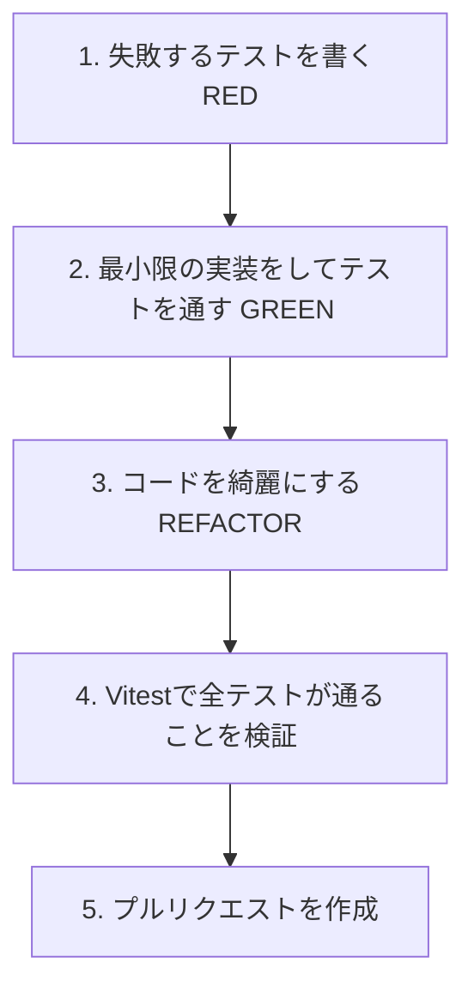

# 🏐 kanji-pay 開発ガイドライン

本ドキュメントは、`kanji-pay` プロジェクトにおける開発ルール、ブランチ運用、コミットメッセージ、およびテスト駆動開発（TDD）の標準手順を定めたガイドラインです。
共同開発者やAIエージェントが、常に一貫した高い品質でコードベースを維持できるように設計されています。

---

## 🌿 1. ブランチ命名規約

作業を行う際は、必ず `main` ブランチから以下の命名規約に従って作業用ブランチを作成してください。

*   **新規機能の開発 (Feature)**: `feature/issue-<Issue番号>-<英語の概要>`
    *   例: `feature/issue-2-development-rules`
*   **バグ修正 (Bug Fix)**: `fix/issue-<Issue番号>-<英語の概要>`
    *   例: `fix/issue-15-stripe-signature-check`
*   **ドキュメント整理やリファクタリング**: `docs/issue-<Issue番号>-<概要>` または `refactor/issue-<Issue番号>-<概要>`
    *   例: `docs/issue-4-update-api-spec`

---

## 💬 2. コミットメッセージ規約

コミットメッセージは、[Conventional Commits](https://www.conventionalcommits.org/) 規格に準拠し、変更の目的がひと目で分かるプレフィックスを必ず付与してください。

| プレフィックス | 意味・用途 | 例 |
| :--- | :--- | :--- |
| `feat:` | 新しい機能の追加 | `feat: add 10-yen rounding logic for split bills` |
| `fix:` | バグやエラーの修正 | `fix: resolve Stripe API base url loading` |
| `test:` | テストコードの追加・変更 | `test: add unit tests for services/api` |
| `docs:` | ドキュメントの作成・更新 | `docs: add development rule guidelines` |
| `refactor:` | 仕様を変えないコードの改善・整理 | `refactor: move api client to services/api` |
| `chore:` | ビルド設定やライブラリ更新など | `chore: add vitest configuration` |

---

## 🧪 3. テスト駆動開発 (TDD) の進め方

本プロジェクトでは、ロジック（`src/domain/`）およびAPI通信層（`src/services/`）の安全性を担保するため、原則として **TDD (テスト駆動開発)** を行います。



### BDD (振る舞い駆動) スタイルの記述
テストコード（`*.test.ts`）は、日本語のBDDスタイルで記述し、「どのような仕様がテストされているか」が誰が見ても一目で分かるようにします。

```typescript
describe('splitBill (割り勘端数計算ロジック)', () => {
  test('【正常系】割り切れる場合、全員が等額になること', () => {
    // 1. テストデータの準備と実行
    // 2. 結果の検証 (expect)
  })
})
```

---

## 🚀 4. プルリクエスト (PR) とマージ運用ルール

1.  **ブランチのプッシュ**:
    *   作業が完了し、ローカルで `npm run test` がすべて合格（Green）になったら、作業ブランチをリモート（GitHub）にプッシュします。
2.  **プルリクエスト（PR）の作成**:
    *   `main` ブランチ宛てにプルリクエストを作成します。
    *   PRの本文には、**「対応するIssue番号」** と **「テスト結果の要約（Walkthrough）」** を必ず明記してください。
3.  **マージの条件**:
    *   GitHub Actions（CI/CD Pipeline）が走り、自動テスト（`test` ジョブ）が正常に完了してグリーンになること。
    *   自分で、またはレビューでコードの整合性に問題がないことを確認し、PRをマージします。
